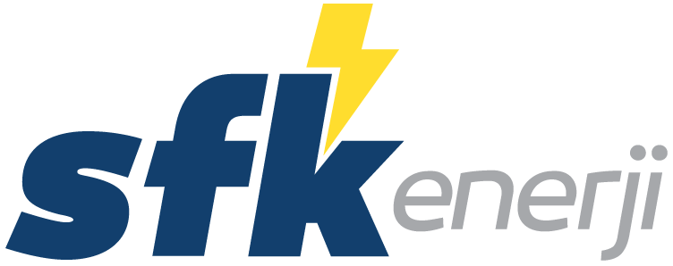

# SFK Enerji — Yeni Nesil Güneş Enerjisi & Mühendislik Platformu

<p align="center">
  
</p>

<p align="center">
  <strong>Geleceğin temiz enerji teknolojileri için geliştirdiğim modern kurumsal web platformu ve dinamik yönetim paneli.</strong>
</p>

<p align="center">
  <a href="https://github.com/Ozzycan/sfkenerji"></a>
  <a href="https://filamentphp.com"></a>
  <a href="https://tailwindcss.com"></a>
  <a href="https://vitejs.dev"></a>
</p>

---

## 📌 Proje Hakkında

Bu projede, güneş enerjisi ve yenilenebilir enerji altyapı yatırımları alanında faaliyet gösteren **SFK Enerji** için sıfırdan modern bir dijital deneyim tasarladım ve geliştirdim. 

Klasik, statik şirket sitelerinin ötesine geçerek; ziyaretçilerin çatı alanı ve faturalarına göre kendi enerji santrallerini hesaplayabilecekleri **İnteraktif bir GES Simülatörü**, anlık teklif alma akışı ve tüm kurumsal içeriğin kod bilgisi gerektirmeden yönetilebildiği **Filament v3 tabanlı bir idari panel** kurguladım.

Tasarım kararları ve mimari prensipler hakkında detaylı bilgi için **[DESIGN.md](DESIGN.md)** dokümanını inceleyebilirsiniz.

---

## 🚀 Öne Çıkan Özellikler

### 🎨 Ön Yüz & Kullanıcı Deneyimi (UI/UX)
- **Liquid Glassmorphism:** Buzlu cam efektleri, yüzen (floating) navigasyon ve modern derinlik katmanları.
- **Ambient Glow & Cursor Light:** Ziyaretçinin fare hareketine duyarlı dinamik ışık izi ve arka plan ışıma efektleri.
- **İnteraktif GES Hesaplama Simülatörü:** Çatı alanı, aylık tüketim ve bina tipine göre anlık kWp gücü, yıllık üretim ve amortisman süresi hesaplayabilen dinamik motor.
- **Kayar Teklif Çekmecesi (Slide-Over Drawer):** Sayfadan ayrılmadan, seçilen paketle otomatik eşleşen AJAX tabanlı teklif formu.
- **Çift Yönlü HTML E-Posta Sistemi:** Teklif iletildiğinde hem SFK Enerji ekibine zengin detaylı bildirim hem de müşteriye otomatik kurumsal teyit e-postası.

### ⚙️ Yönetim Paneli (Filament v3)
- **Paket Yönetimi (`EnergyPackage`):** Ev, ticari ve tarımsal sulama paketlerinin teknik detayları, özellikleri ve fiyatlandırmaları.
- **Proje Portföyü (`Project`):** Tamamlanan santrallerin görsel galerisi, kurulu güç değerleri ve konum bilgileri.
- **Hizmet Kataloğu (`Service`):** Mühendislik, bakım-onarım ve danışmanlık hizmetlerinin dinamik yönetimi.
- **Site Metrikleri & Ayarları (`SiteSetting`):** İletişim bilgileri, sosyal medya kanalları, vizyon metinleri ve ana sayfadaki istatistik sayaçları (MW kapasitesi, tamamlanan proje sayısı vb.).
- **Güvenlik & Profil:** Filament Breezy entegrasyonu ile iki faktörlü kimlik doğrulama ve güvenli oturum yönetimi.

### 🌐 Dağıtım & Hosting Çözümleri
- Paylaşımlı cPanel sunucularda terminal/SSH olmadan önbellek, sembolik link ve migration işlemlerini güvenle tetikleyen yardımcı rotalar (`/cache-temizle`, `/storage-bagla`, `/image-render`, `/veritabani-guncelle`).

---

## 🛠️ Teknoloji Yığını

- **Backend:** PHP 8.3+, Laravel 11.x / 13.x
- **Admin Panel:** Filament v3 (Livewire 3 + Alpine.js)
- **Frontend / Styling:** Vanilla CSS, Tailwind CSS 3, Modern JavaScript (ES6+)
- **Build Tool:** Vite
- **Mail Altyapısı:** Symfony Mailer (SMTP / SMTPS)
- **Veritabanı:** MySQL / MariaDB (Eloquent ORM)

---

## 💻 Kurulum ve Yerel Geliştirme

Projeyi yerel ortamınızda ayağa kaldırmak için:

```bash
# 1. Projeyi klonlayın
git clone https://github.com/Ozzycan/sfkenerji.git
cd sfkenerji

# 2. PHP ve Node bağımlılıklarını kurun
composer install
npm install

# 3. Ortam dosyasını hazırlayın ve anahtar üretin
cp .env.example .env
php artisan key:generate

# 4. Veritabanı tablolarını ve örnek verileri yükleyin
php artisan migrate --seed

# 5. Storage bağlantısını oluşturun
php artisan storage:link

# 6. Geliştirme sunucusunu ve varlık derleyicisini başlatın
npm run dev
# Başka bir terminalde:
php artisan serve
```

Yönetim paneline erişmek için: `http://localhost:8000/admin`

---

## 📄 Lisans & Geliştirici

Bu proje **[Oguzhan Doğan (Ozzycan)](https://github.com/Ozzycan)** tarafından SFK Enerji için tasarlanmış ve geliştirilmiştir. Tüm hakları saklıdır.
